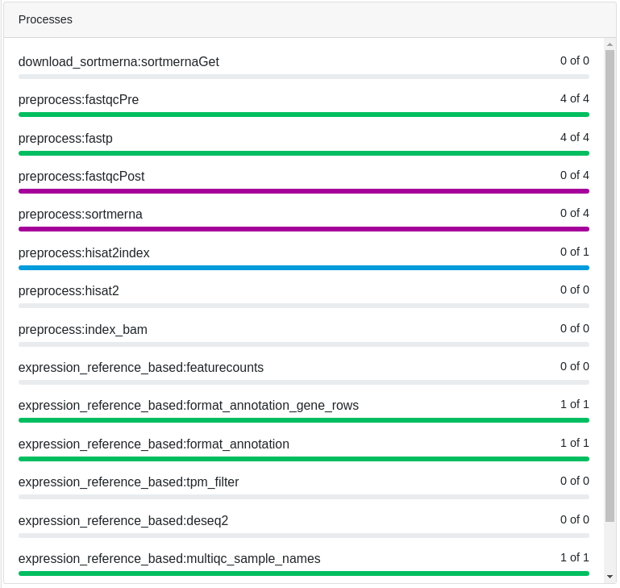
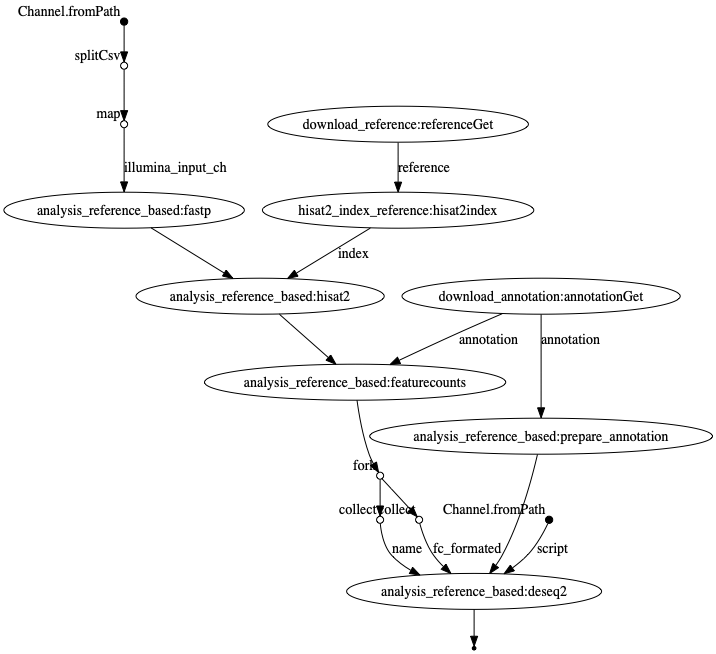

____


[](https://doi.org/10.3390/genes11121487)
[](https://doi.org/10.3390/genes11121487)


<!--[](https://www.)-->

## RNAflow - An effective and simple RNA-Seq differential gene expression pipeline using Nextflow<!-- omit in toc -->


*Figure 1.* Workflow. The user can decide after preprocessing to run a differential gene expression (DEG) analysis or a transcriptome assembly. Circles symbolize input data and download icons symbolize automated download of resources. Steps marked by asterisks are currently only available for some species. See [here](citations.md) for a list of references for the used tools and please consider to cite them as well.

<details><summary><b>Table of Contents</b></summary>

- [Quick installation](#quick-installation)
- [Quick start](#quick-start)
  - [Start a test run](#start-a-test-run)
  - [Call help](#call-help)
  - [Update the pipeline](#update-the-pipeline)
  - [Use a certain release](#use-a-certain-release)
- [Usage](#usage)
  - [Input files](#input-files)
    - [Read files (required)](#read-files-required)
    - [Genomes and annotation](#genomes-and-annotation)
    - [Build-in species](#build-in-species)
    - [Comparisons for DEG analysis](#comparisons-for-deg-analysis)
  - [Resume your run](#resume-your-run)
- [Workflow control](#workflow-control)
  - [Preprocessing](#preprocessing)
  - [DEG analysis](#deg-analysis)
  - [Transcriptome assembly](#transcriptome-assembly)
- [Profiles/configuration options](#profilesconfiguration-options)
  - [Executor options...](#executor-options)
  - [Engine options...](#engine-options)
- [Monitoring](#monitoring)
- [Output](#output)
  - [DESeq2 results](#deseq2-results)
- [Working offline](#working-offline)
- [Help message](#help-message)
- [Known bugs and issues](#known-bugs-and-issues)
  - [Problems with `SortMeRNA`/ `HISAT2` error (#141, [#116](https://github.com/hoelzer-lab/rnaflow/issues/116))](#problems-with-sortmerna-hisat2-error-141-116)
    - [Description](#description)
    - [Workaround](#workaround)
- [Citation](#citation)

</details>


## Quick installation

The pipeline is written in [`Nextflow`](https://nf-co.re/usage/installation), which can be used on any POSIX compatible system (Linux, OS X, etc). Windows system is supported through [WSL](https://en.wikipedia.org/wiki/Windows_Subsystem_for_Linux). You need `Nextflow` installed and either `conda`, `Docker`, or `Singularity` to run the steps of the pipeline:

1. Install  `Nextflow`
    <details><summary>click here for a bash one-liner </summary>

    ```bash
    wget -qO- https://get.nextflow.io | bash
    # In the case you don’t have wget
    # curl -s https://get.nextflow.io | bash
    ```

    </details>
1. Install [`conda`](https://conda.io/miniconda.html)
    <details><summary>click here for a bash two-liner for Miniconda3 Linux 64-bit</summary>

    ```bash
    wget https://repo.anaconda.com/miniconda/Miniconda3-latest-Linux-x86_64.sh
    bash Miniconda3-latest-Linux-x86_64.sh
    ```

    </details>

OR

1. Install `conda`
    <details><summary>click here for a bash two-liner for Miniconda3 Linux 64-bit</summary>

    ```bash
    wget https://repo.anaconda.com/miniconda/Miniconda3-latest-Linux-x86_64.sh
    bash Miniconda3-latest-Linux-x86_64.sh
    ```

    </details>
1. Install `Nextflow` via `conda`
    <details><summary>click here to see how to do that</summary>

    ```bash
    conda create -n nextflow -c bioconda nextflow
    conda active nextflow
    ```

    </details>

For transcriptome assembly you have to install also [`Docker`](https://docs.docker.com/engine/installation/) or [`Singularity`](https://github.com/hpcng/singularity/blob/master/INSTALL.md).

1. You can try to simply install `Singularity` via `conda` as well
    <details><summary>click for an example command</summary>

    ```bash
    conda create -n singularity -c conda-forge singularity
    conda active singularity
    ```

    or if you already have a conda environment for nextflow:

    ```bash
    conda activate nextflow
    conda install -c conda-forge singularity
    ```

    </details>

A system admin-configured `Singularity` installation should be preferred in comparison to an own local conda installation. Please ask your sys admin!

All other dependencies and tools will be installed within the pipeline via `conda`, `Docker` or `Singularity` depending on the profile you run (see [below](#profiles/configuration-options)).

## Quick start

### Start a test run

```bash
# conda active nextflow
nextflow run hoelzer-lab/rnaflow -profile test,conda,local
```

... performs

- a differential gene expression analysis with sub-sampled human read data,
- on a reduced human genome and annotation (chromosome 1, 10 and 11),
- comparing two conditions (MAQCA, MAQCB),
- with a local execution (uses max. 4 cores in total and 8GB) and
- `conda` dependency management.

<details><summary>Resource usage</summary>

For a local test run (with 30 cores in total at maximum):

```bash
nextflow run hoelzer-lab/rnaflow -profile test,conda,local -w work \
--max_cores 30 --cores 10 --softlink_results -r master
```

we observed the following resource usage including downloads and `conda` environment creation for each process:

<dl>
<dt>Total runtime</dt>
<dd>25m 56s</dd>
<dt>Physical memory (RAM), max.</dt>
<dd>3.015 GB at process <code>hisat2index</code></dd>
<dt>Virtual memory (RAM + Disk swap), max.</dt>
<dd>10.16 GB at process <code>hisat2</code></dd>
</dl>

A detailed HTML report automatically produced the pipeline can be found [here](test-data/execution_report.html).

</details>

### Call help

```bash
nextflow run hoelzer-lab/rnaflow --help
```

### Update the pipeline

```bash
nextflow pull hoelzer-lab/rnaflow
```

### Use a certain release

We recommend to use a [stable release](https://github.com/hoelzer-lab/rnaflow/releases) of the pipeline:

```bash
nextflow pull hoelzer-lab/rnaflow -r <RELEASE>
```


## Usage

```bash
nextflow run hoelzer-lab/rnaflow --reads input.csv --autodownload hsa --pathway hsa --max_cores 6 --cores 2
```

with `--autodownload <hsa|mmu|mau|eco>` [build-in species](#build-in-species), or define your own genome reference and annotation files in CSV files:

```bash
nextflow run hoelzer-lab/rnaflow --reads input.csv --genome fastas.csv --annotation gtfs.csv --max_cores 6 --cores 2
```

Genomes and annotations from `--autodownload`, `--genome` and `--annotation` are concatenated.

By default, all possible comparisons are performed. Use `--deg` to change this.

`--pathway <hsa|mmu|mau>` performs downstream pathway analysis. Available are WebGestalt set enrichment analysis (GSEA) for `hsa`, piano GSEA with different settings and consensus scoring for `hsa`, `mmu` and `mau`.

### Input files

#### Read files (required)

Specify your read files in `FASTQ` format with `--reads input.csv`. The file `input.csv` has to look like this for single-end reads:

```csv
Sample,R,Condition,Source
mock_rep1,/path/to/reads/mock1.fastq.gz,mock,
mock_rep2,/path/to/reads/mock2.fastq.gz,mock,
mock_rep3,/path/to/reads/mock3.fastq.gz,mock,
treated_rep1,/path/to/reads/treat1.fastq.gz,treated,
treated_rep2,/path/to/reads/treat2.fastq.gz,treated,
treated_rep3,/path/to/reads/treat3.fastq.gz,treated,
```

and for paired-end reads, like this:

```csv
Sample,R1,R2,Condition,Source
mock_rep1,/path/to/reads/mock1_1.fastq,/path/to/reads/mock1_2.fastq,mock,A
mock_rep2,/path/to/reads/mock2_1.fastq,/path/to/reads/mock2_2.fastq,mock,B
mock_rep3,/path/to/reads/mock3_1.fastq,/path/to/reads/mock3_2.fastq,mock,C
treated_rep1,/path/to/reads/treat1_1.fastq,/path/to/reads/treat1_2.fastq,treated,A
treated_rep2,/path/to/reads/treat2_1.fastq,/path/to/reads/treat2_2.fastq,treated,B
treated_rep3,/path/to/reads/treat3_1.fastq,/path/to/reads/treat3_2.fastq,treated,C
```

The first line is a required header. Read files can be compressed (`.gz`). You need at least two replicates for each condition to run the pipeline. Source labels are optional - the header is still required, the value can be empty as in the single-end example above. Source labels can be used to define the corresponding experiment even more precisely for improved differential expression testing, e.g. if RNA-Seq samples come from different `Condition`s (e.g. tissues) but the same `Source`s (e.g. patients). Still, the comparison will be performed between the `Condition`s but the `Source` information is additionally used in designing the DESeq2 experiment. Source labels also extend the heatmap sample annotation.

#### Genomes and annotation

If you don't use one of the [build-in species](#build-in-species), specify your genomes via `--genome fastas.csv`, with `fastas.csv` looking like this:

```
/path/to/reference_genome1.fasta
/path/to/reference_genome2.fasta
```

and `--annotation gtfs.csv` with `gtfs.csv` looking like this:

```
/path/to/reference_annotation_1.gtf
/path/to/reference_annotation_2.gtf
```

You can add a [build-in species](#build-in-species) to your defined genomes and annotation with `--autodownload xxx`.

#### Build-in species

We provide a small set of build-in species for which the genome and annotation files are automatically downloaded from [Ensembl](https://www.ensembl.org/index.html) with `--autodownload xxx`. Please let us know, we can easily add other species.

| Species      | three-letter shortcut | Genome                              | Annotation                                    |
| ------------ | --------------------- | ----------------------------------- | --------------------------------------------- |
| Homo sapiens | `hsa` <sup>*</sup>               | Homo_sapiens.GRCh38.98              | Homo_sapiens.GRCh38.dna.primary_assembly      |
| Mus musculus | `mmu` <sup>*</sup>               | Mus_musculus.GRCm38.99              | Mus_musculus.GRCm38.dna.primary_assembly      |
| Mesocricetus auratus | `mau` <sup>*</sup>               | Mesocricetus_auratus.MesAur1.0.100  | Mesocricetus_auratus.MesAur1.0.dna.toplevel   |
| Escherichia coli | `eco`                 | Escherichia_coli_k_12.ASM80076v1.45 | Escherichia_coli_k_12.ASM80076v1.dna.toplevel |

<sup>*</sup> Downstream pathway analysis availible via `--pathway xxx`.

#### Comparisons for DEG analysis

Per default, all possible pairwise comparisons _in one direction_ are performed. Thus, when _A_ is compared against _B_ the pipeline will not automatically compare _B_ vs. _A_ which will anyway only change the direction of the finally resulting fold changes. To change this, please define the needed comparison with `--deg comparisons.csv`, where each line contains a pairwise comparison:

```csv
Condition1,Condition2
conditionX,conditionY
conditionA,conditionB
conditionB,conditionA
```

The first line is a required header. 

### Resume your run

You can easily resume your run in case of changes to the parameters or inputs. Nextflow will try to not recalculate steps that are already done:

```
nextflow run hoelzer-lab/rnaflow -profile test,conda,local -resume
```

Nextflow will need access to the working directory where temporary calculations are stored. Per default, this is set to `work` but can be adjusted via `-w /path/to/any/workdir`. In addition, the `.nextflow.log` file is needed to resume a run, thus, this will only work if you resume the run from the same folder where you started it. 

## Workflow control

### Preprocessing

```bash
--mode                                 # either 'single' (single-end) or 'paired' (paired-end) sequencing [default single]
--skip_sortmerna                       # skip rRNA removal via SortMeRNA [default false]
--fastp_additional_params              # additional parameters for fastp [default '-5 -3 -W 4 -M 20 -l 15 -x -n 5 -z 6']
--hisat2_additional_params             # additional parameters for HISAT2
--featurecounts_additional_params      # additional parameters for FeatureCounts [default: -t gene -g gene_id]
```

### DEG analysis

```bash
--strand                        # strandness for counting with featureCounts: 0 (unstranded), 1 (stranded) and 2 (reversely stranded) [default 0]
--tpm                           # threshold for TPM (transcripts per million) filter [default 1]
--deg                           # a CSV file following the pattern: conditionX,conditionY
--pathway                       # perform different downstream pathway analysis for the species hsa|mmu|mau
--feature_id_type               # ID type for downstream analysis [default: ensembl_gene_id]
```

### Transcriptome assembly

```bash
--assembly                      # switch to transcriptome assemlby
--busco_db                      # BUSCO database ['euarchontoglires' or path to existing DB]
--dammit_uniref90               # add UniRef90 to dammit databases, takes long [false]
--rna                           # activate directRNA mode for ONT transcriptome assembly [default: false (cDNA)]
```

## Profiles/configuration options

Per default, the pipeline is locally executed with `conda` dependency management (corresponds to `-profile local,conda`). Adjust this setting by combining an _executer_ option with an _engine_ option, e.g. `-profile local,conda` or `-profile slurm,conda`. We also provide container support, see [below](#engine-options...).

### Executor options...

*... or how to schedule your workload.*

Currently implemented are `local`, `slurm` and `lsf` executions.

You can customize `local` with this parameters:

```bash
--cores                         # cores for one process [default 1]
--max_cores                     # max. cores used in total [default allAvailable]
--memory                        # max. memory in GB for local use [default 8 GB]
```

### Engine options...

*... or in which environment to run the tools.*

Currently implemented are `conda`, `Docker` and `Singularity`. For transcriptome assembly some tools need to be run with `Docker` or `Singularity`.

You can switch between different engines via `-profile`, for example:

```
nextflow run hoelzer-lab/rnaflow -profile test,local,conda
nextflow run hoelzer-lab/rnaflow -profile test,local,docker
nextflow run hoelzer-lab/rnaflow -profile test,slurm,singularity
```

As a __best practice__ for a local execution, we recommend to run the pipeline with `--cores 1 --max_cores 1` the first time you use `Singularity`, because we experienced issues when generating the `Singularity` images in parallel the first time the pipeline is executed with this engine option.

You can customize where `conda` environments are stored using

```bash
--condaCacheDir /path/to/dir
```

and where `Singularity` images are stored via

```bash
--singularityCacheDir /path/to/dir
```

`Docker` images are stored based on your system configuration.

## Monitoring

 

To monitor your computations the pipeline can be connected to [Nextflow Tower](https://tower.nf). You need an user access token to connect your Tower account with the pipeline. Simply [generate a login](https://tower.nf/login) using your email and then click the link send to this address.

> "Nextflow Tower does not require a password or registration procedure. Just provide your email address and we'll send you an authentication link to login. That's all!"

Once logged in, click on your avatar on the top right corner and select "Your tokens". Generate a token or copy the default one and set the environment variable:

```bash
export TOWER_ACCESS_TOKEN=<YOUR_COPIED_TOKEN>
export NXF_VER=20.10.0
```

You can save this command to your `.bashrc` or `.profile` to not need to enter it again.

Now run:

```bash
nextflow run hoelzer-lab/rnaflow -profile test,local,conda -with-tower
```

Alternatively, you can also activate the Tower connection within the `nextflow.config` file located in the root GitHub directory:

```java
tower {
    accessToken = ''
    enabled = true
} 
```

You can also directly enter your access token here instead of generating the above environment variable.

## Output

The result folder is structured by each step and tool (`results/step/tool`) as follows:

```
results/
├── 01-Trimming
│   └── fastp                   trimmed reads
├── 02-rRNARemoval
│   └── SortMeRNA               rRNA-free (and trimmed) reads
├── 03-Mapping
│   └── HISAT2                  mapping results in BAM format with index files (BAI)
├── 04-Counting
│   └── featureCounts           counting table
├── 05-CountingFilter
│   └── TPM                     counting table with additional TPM value; formatted counting table filtered by TPM
├── 06-Annotation               filtered annotation; gene id, name and bio type mapping
├── 07-DifferentialExpression
│   └── DESeq2                  see below
├── 08-Assembly
│   └── de_novo
│      └── Trinity              Trinity assembly  (with --assembly)
├── 09-RNA-Seq_Annotation       BUSCO, dammit and StringTie2 results (with --assembly)
├── Logs                        Nextflow execution timeline and workflow report
└── Summary                     MultiQC report
```

Please note, that `08-Assembly` and `09-RNA-Seq_Annotation` are part of the transcriptome assembly branch (`--assembly`). Here, steps `04` to `07` are currently not applicable.

### DESeq2 results

The `DESeq2` result is structured as follows:

```
07-DifferentialExpression/
└── DESeq2
   ├── data                         
   │   ├── counts                   normalized, transformed counts; size factors table
   │   └── input                    DESeq2 input summary
   ├── deseq2.Rout                  R log file
   ├── MAQCA_vs_MAQCB               results for pairwise comparison (here exemplarily for the -profile test data set)
   │   ├── downstream_analysis  
   │   │   ├── piano                piano results
   │   │   └── WebGestalt           WebGestalt results
   │   ├── input                    DESeq2 input summary
   │   ├── plots
   │   │   ├── heatmaps
   │   │   ├── MA
   │   │   ├── PCA
   │   │   ├── sample2sample
   │   │   └── volcano
   │   ├── reports                  DESeq2 result HTML table; summary report
   │   └── results                  raw and filtered DESeq2 result in CSV and XLSX format; DEG analysis summary
   └── plots                        heatmaps and PCA of all samples
```

We provide `DESeq2` normalized, regularized log (rlog), variance stabilized (vsd) and log2(n+1) (ntd) transformed count tables (`DESeq2/data/counts`).

For each comparison (specified with `--deg` or, per default, all possible pairwise comparisons in one direction), a new folder `X_vs_Y` is created. This also describes the direction of the comparison, e.g. the log2FoldChange describes the change of a gene under condition B with respect to the gene under condition A.

Downstream analysis (`--pathway xxx`) are currently provided for some species: GSEA consensus scoring with `piano` for *Homo sapiens* (`hsa`), *Mus musculus* (`mmu`) and *Mesocricetus auratus* (`mau`); and `WebGestalt` GSEA for *Homo sapiens* and *Mus musculus*.

## Working offline

In case you don't have an internet connection, here is a workaround to [this issue](https://github.com/hoelzer-lab/rnaflow/issues/102) for manual download and copying of external recourses:

- Genomes and annotation can also be specified via `--genome` and `--annotaion`, see [here](#genomes-and-annotation).
- For `BUSCO` it is a simple download, see [here](modules/buscoGetDB.nf) with `busco_db = 'euarchontoglires_odb9'` as default.
- For `SortMeRNA` and `dammit` the tools must be installed. Version specifications can be found [here](envs/sortmerna.yaml) and [there](envs/dammit.yaml), the code to create the databases [here](modules/sortmernaGet.nf) and [there](modules/dammitGetDB.nf) with `busco_db = 'euarchontoglires_odb9'` `dammit_uniref90 = false` as default.
- Downstream analysis with `piano` and `WebGestalt` currently need an internet connection in any case. If no connection is available `piano` and `WebGestalt` are skipped.

<details><summary>RNAflow looks up the files here:</summary>

```
nextflow-autodownload-databases     # default: `permanentCacheDir = 'nextflow-autodownload-databases'`
└── databases
    └── busco
        └── <busco_db>.tar.gz
    └── dammit
        └── <busco_db>.tar.gz
        └── uniref90                # in case of `dammit_uniref90 = true`
            └── <busco_db>.tar.gz
    └── sortmerna
        └── data
            └── rRNA_databases
```

</details>

## Help message

<details><summary>click here to see the complete help message</summary>

```
Usage examples:
nextflow run hoelzer-lab/rnaflow -profile test,local,conda
nextflow run hoelzer-lab/rnaflow --cores 4 --reads input.csv --autodownload mmu --pathway mmu
nextflow run hoelzer-lab/rnaflow --cores 4 --reads input.csv --autodownload eco --assembly
nextflow run hoelzer-lab/rnaflow --cores 4 --reads input.csv --genome fasta_virus.csv --annotation gtf_virus.csv --autodownload hsa --pathway hsa
Genomes and annotations from --autodownload, --genome and --annotation are concatenated.

Input:
--reads                  A CSV file following the pattern: Sample,R,Condition,Source for single-end or Sample,R1,R2,Condition,Source for paired-end
                                    (check terminal output if correctly assigned)
                                    Per default, all possible comparisons of conditions in one direction are made. Use --deg to change.
--autodownload           Specifies the species identifier for automated download [default: ]
                                    Currently supported are:
                                    - hsa [Ensembl: Homo_sapiens.GRCh38.dna.primary_assembly | Homo_sapiens.GRCh38.98]
                                    - eco [Ensembl: Escherichia_coli_k_12.ASM80076v1.dna.toplevel | Escherichia_coli_k_12.ASM80076v1.45]
                                    - mmu [Ensembl: Mus_musculus.GRCm38.dna.primary_assembly | Mus_musculus.GRCm38.99.gtf]
                                    - mau [Ensembl: Mesocricetus_auratus.MesAur1.0.dna.toplevel | Mesocricetus_auratus.MesAur1.0.100]
--species                Specifies the species identifier for downstream path analysis. (DEPRECATED)
                         If `--include_species` is set, reference genome and annotation are added and automatically downloaded. [default: ]
                                    Currently supported are:
                                    - hsa [Ensembl: Homo_sapiens.GRCh38.dna.primary_assembly | Homo_sapiens.GRCh38.98]
                                    - eco [Ensembl: Escherichia_coli_k_12.ASM80076v1.dna.toplevel | Escherichia_coli_k_12.ASM80076v1.45]
                                    - mmu [Ensembl: Mus_musculus.GRCm38.dna.primary_assembly | Mus_musculus.GRCm38.99.gtf]
                                    - mau [Ensembl: Mesocricetus_auratus.MesAur1.0.dna.toplevel | Mesocricetus_auratus.MesAur1.0.100]
--genome                 CSV file with genome reference FASTA files (one path in each line)
                                    If set, --annotation must also be set.
--annotation             CSV file with genome annotation GTF files (one path in each line)
--include_species        Either --species or --genome/--annotation need to be used. Both input seetings can be also combined to use genome and annotation of 
                         supported species in addition to --genome and --annotation [default: false]

Preprocessing options:
--mode                             Either 'single' (single-end) or 'paired' (paired-end) sequencing [default: single]
--fastp_additional_params          additional parameters for fastp [default: -5 -3 -W 4 -M 20 -l 15 -x -n 5 -z 6]
--skip_sortmerna                   Skip rRNA removal via SortMeRNA [default: false] 
--hisat2_additional_params         additional parameters for HISAT2 [default: ]
--featurecounts_additional_params  additional parameters for FeatureCounts [default: -t gene -g gene_id]

DEG analysis options:
--strand                 0 (unstranded), 1 (stranded) and 2 (reversely stranded) [default: 0]
--tpm                    Threshold for TPM (transcripts per million) filter. A feature is discared, if for all conditions the mean TPM value of all 
                         corresponding samples in this condition is below the threshold. [default: 1]
--deg                    A CSV file following the pattern: conditionX,conditionY
                         Each line stands for one differential gene expression comparison.  
                         Must match the 'Condition' labels defined in the CSV file provided via --reads.  
--pathway                Perform different downstream pathway analysis for the species. [default: ]
                         Currently supported are:
                             - hsa | Homo sapiens
                             - mmu | Mus musculus
                             - mau | Mesocricetus auratus
--feature_id_type        ID type for downstream analysis [default: ensembl_gene_id]                            

Transcriptome assembly options:
--assembly               Perform de novo and reference-based transcriptome assembly instead of DEG analysis [default: false]
--busco_db               The database used with BUSCO [default: euarchontoglires_odb9]
                         Full list of available data sets at https://busco-data.ezlab.org/v5/data/lineages/ 
--dammit_uniref90        Add UniRef90 to the dammit databases (time consuming!) [default: false]
--rna                    Activate directRNA mode for ONT transcriptome assembly [default: false (cDNA)]

Computing options:
--cores                  Max cores per process for local use [default: 1]
--max_cores              Max cores used on the machine for local use [default: 4]
--memory                 Max memory in GB for local use [default: 8 GB]
--output                 Name of the result folder [default: results]

Caching:
--permanentCacheDir      Location for auto-download data like databases [default: nextflow-autodownload-databases]
--condaCacheDir          Location for storing the conda environments [default: conda]
--singularityCacheDir    Location for storing the singularity images [default: singularity]
--workdir                Working directory for all intermediate results [default: null] (DEPRECATED: use `-w your/workdir` instead)
--softlink_results       Softlink result files instead of copying.

Nextflow options:
-with-tower              Activate monitoring via Nextflow Tower (needs TOWER_ACCESS_TOKEN set).
-with-report rep.html    CPU / RAM usage (may cause errors).
-with-dag chart.html     Generates a flowchart for the process tree.
-with-timeline time.html Timeline (may cause errors).

Execution/Engine profiles:
The pipeline supports profiles to run via different Executers and Engines e.g.: -profile local,conda

Executer (choose one):
  local
  slurm
  lsf
  latency

Engines (choose one):
  conda
  docker
  singularity

Per default: -profile local,conda is executed. 

For a test run (~ 15 min), add "test" to the profile, e.g. -profile test,local,conda.
The command will create all conda environments and download and run test data.

We also provide some pre-configured profiles for certain HPC environments:    
  ara (slurm, conda and parameter customization)
```

</details>

## Known bugs and issues

### Problems with `SortMeRNA`/ `HISAT2` error ([#141](https://github.com/hoelzer-lab/rnaflow/issues/141), [#116](https://github.com/hoelzer-lab/rnaflow/issues/116))

#### Description

The pipeline fails with something like 
 
<details><summary>this</summary>

```
Error executing process > 'preprocess:hisat2 (2)'

Caused by:
  Missing output file(s) `22_rep4_summary.log` expected by process `preprocess:hisat2 (2)`

Command executed:

  hisat2 -x reference -1 22_rep4.R1.other.fastq.gz -2 22_rep4.R2.other.fastq.gz -p 60 --new-summary --summary-file 22_rep4_summary.log  | samtools view -bS | samtools sort -o 22_rep4.sorted.bam -T tmp --threads 60

Command exit status:
  0

Command output:
  (empty)

Command error:
  Error: Read AFFFJJJJJJJJJJJJJJJJJJJJJJJJJJJJJJJJJJJJJJJJJJJJJJJJJJJJJJJJJJJJJJJJJJJJJJJJJJJJJJJJJJJJJJJJJJJJJJJJJJJ has more quality values than read characters.
  terminate called after throwing an instance of 'int'
  Aborted (core dumped)
  (ERR): hisat2-align exited with value 134
  [bam_sort_core] merging from 0 files and 60 in-memory blocks...
  grep: warning: GREP_OPTIONS is deprecated; please use an alias or script
  
Work dir:
  /tmp/nextflow-work-as11798/2f/4a5b7060530705c2697bdf3eec73a4

Tip: when you have fixed the problem you can continue the execution adding the option `-resume` to the run command line
```

</details>

- Often encountered when running in `screen` or `tmux`
- Nextflow's `-bg` option does not help

#### Workaround

- Skip `SortMeRNA` with `--skip_sortmerna`
- Reads can be cleand beforhand e.g. with [CLEAN](https://github.com/hoelzer/clean)

### Latency problems on HPCs, issue ([#79](https://github.com/hoelzer-lab/rnaflow/issues/79))

#### Description

Latency related problems with `Nextflow` might occur when running on HPC systems, where `Nextflow` expects files to be available before they are fully written to the file system. In these cases `Nextflow` might get stuck or report missing output or input files to some processes:
 

```
ERROR ~ Error executing process > 'some_process'

Caused by:
 Missing output file(s) `some_process.out` expected by process `some_process`

```


- Often encountered when running on HPC systems


#### Workaround
Please try running the pipeline with the `latency` profile activated, just add it to the profiles you already defined:

```
-profile slurm,conda,latency
```

## Citation 

If you use RNAflow please cite: 

* [RNAflow](https://hoelzer-lab.github.io/publications)
> Marie Lataretu and Martin Hölzer. "RNAflow: An effective and simple RNA-Seq differential gene expression pipeline using Nextflow". Genes 2020, 11(12), 1487; https://doi.org/10.3390/genes11121487
<!-- ## Help message
```
``` -->

<!-- # Flow chart

 -->
